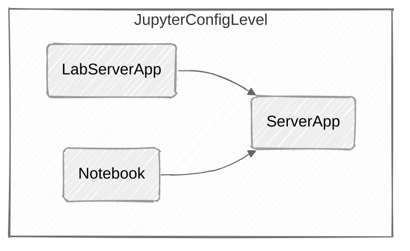

# 远程服务器（Windows）配置

*[breadcrumb block not supported]*

> 下述实践均基于阿里云ECS Windows版本为数据中心版（2022）

所有在本地运行的Web服务均需要绑定本地主机在局域网/公网中的IP地址才能使用

域名访问的重要环节：

服务器：通配符域名证书→NGINX正确加载配置文件→服务器默认防火墙→服务器控制台安全组→CF的DNS→

## OpenSSH

> 远程连接与SFTP服务

### 安装

OpenSSH目前为Windows的可选功能，需要用户手动安装

1. 打开设置→应用→可选功能→添加功能

2. 选择安装OpenSSH服务器

### 配置

1. **打开SSH服务**：使用组件服务中的服务，找到OpenSSH进程，将类型改为自动）

2. **修改SSH配置文件**：OpenSSH文件配置文件名称：`sshd_config` 在目录`C:\ProgramData\ssh` 中
    <details>
    <summary>**配置文件**</summary>

        ```powershell
        ***
        
        PubkeyAuthentication yes
        
        # The default is to check both .ssh/authorized_keys and .ssh/authorized_keys2
        # but this is overridden so installations will only check .ssh/authorized_keys
        AuthorizedKeysFile	.ssh/authorized_keys
        
        ***
        
        #(此处为可选) To disable tunneled clear text passwords, change to no here!
        PasswordAuthentication no
        #PermitEmptyPasswords no
        
        ChrootDirectory  "C:\"
        
        ***
        
        #Match Group administrators
        #       AuthorizedKeysFile __PROGRAMDATA__/ssh/administrators_authorized_keys
        ```

    </details>


### 连接

**生成密钥从终端连接**：可以使用XFTP，Terminus等通过SSH连接远端服务器

## JupyterLab

> PythonNoteBook，提供WebUI

### 快速启动

#### 安装

```powershell
pip install jupyterlab
```

:::note 💡

需要安装Node.js，否则有可能提示错误❌

::: 

#### 启动

```powershell
#在选定的根目录中打开命令行
jupyter [Application] #[lab,notebook,server]
```

:::note 💡

此时Jupyter仅能在本地访问

::: 

### 配置

#### 配置文件

**文件层级**



由上到下为Jupyter的配置文件调用层级，上层会覆盖下层的配置

**生成配置文件模板**

```powershell
jupyter server --generate-config
```

**添加配置选项**


代码补全：

```powershell
pip install python-lsp-server[all]
pip install jupyterlab-lsp
```

设置

SSL错误：运行下面的命令：

```powershell
import os
import os.path
import ssl
import stat
import subprocess
import sys

STAT_0o775 = ( stat.S_IRUSR | stat.S_IWUSR | stat.S_IXUSR
             | stat.S_IRGRP | stat.S_IWGRP | stat.S_IXGRP
             | stat.S_IROTH |                stat.S_IXOTH )


def main():
    openssl_dir, openssl_cafile = os.path.split(
        ssl.get_default_verify_paths().openssl_cafile)

    print(" -- pip install --upgrade certifi")
    subprocess.check_call([sys.executable,
        "-E", "-s", "-m", "pip", "install", "--upgrade", "certifi"])

    import certifi

    # change working directory to the default SSL directory
    os.chdir(openssl_dir)
    relpath_to_certifi_cafile = os.path.relpath(certifi.where())
    print(" -- removing any existing file or link")
    try:
        os.remove(openssl_cafile)
    except FileNotFoundError:
        pass
    print(" -- creating symlink to certifi certificate bundle")
    os.symlink(relpath_to_certifi_cafile, openssl_cafile)
    print(" -- setting permissions")
    os.chmod(openssl_cafile, STAT_0o775)
    print(" -- update complete")

if __name__ == '__main__':
    main()
```

## FileBrowser配置（远程管理文件）

## Ngnix配置（反向代理）

带有NTLM(微软AD跨域验证的)的第三方编译Nginx.exe

*[file block not supported]*

## Cloudflare配置

Cloudflare默认将所有https流量转发到http，需要设置全程SSL


[Bookmark](https://github.com/nuclearrockstone/NuclearBomb)

